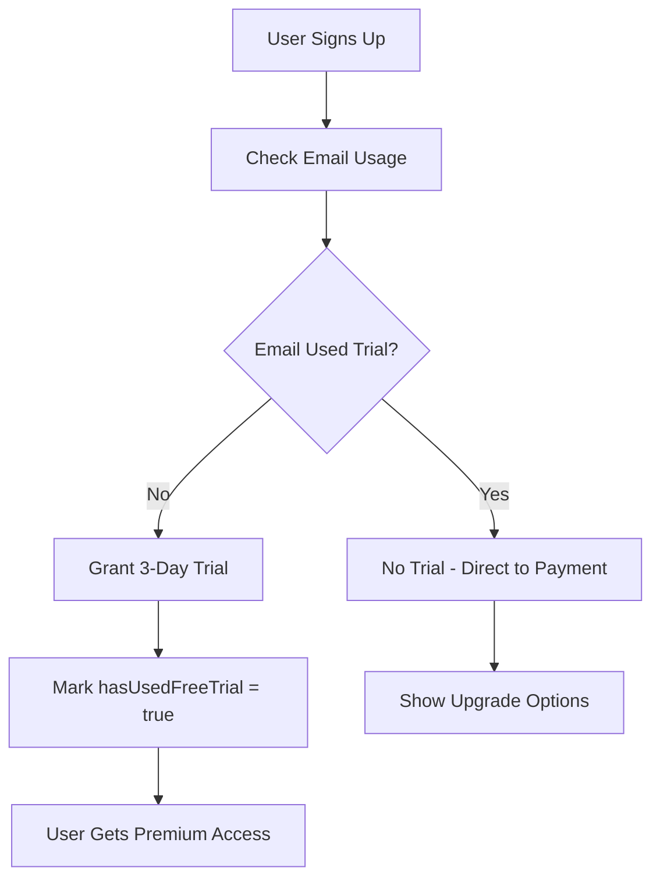

# One Trial Per Email Implementation

## 🎯 **Feature Overview**

This implementation ensures that each email address can only activate a free trial **once**, preventing users from creating multiple accounts to abuse the 3-day free trial system.

## ✅ **Implementation Details**

### 1. **Database Changes**

#### User Model Updates (`src/models/user-model.ts`):
```typescript
// New fields added to IUser interface and schema
hasUsedFreeTrial?: boolean;     // Tracks if user has used their trial
trialUsedAt?: Date;            // When the trial was activated
```

#### Schema Fields:
```typescript
hasUsedFreeTrial: {
  type: Boolean,
  default: false
},
trialUsedAt: {
  type: Date
}
```

### 2. **Backend Logic Updates**

#### Enhanced Trial Initialization (`src/services/subscription-service.ts`):
- ✅ **User-Level Check**: Verifies if current user has already used trial
- ✅ **Email-Level Check**: Prevents multiple accounts with same email from getting trials
- ✅ **Subscription Check**: Ensures no existing active subscriptions
- ✅ **Automatic Marking**: Marks trial as used when activated

#### New Methods Added:
1. **`isEligibleForTrial(userId)`** - Comprehensive eligibility check
2. **Enhanced `initializeTrialSubscription(userId)`** - Now includes trial usage validation

#### New API Endpoint:
```bash
GET /api/payment/subscription/trial-eligibility
```
Returns: `{ eligible: boolean, message: string }`

### 3. **Frontend Integration**

#### Settings Page Enhancement:
- ✅ **Trial Eligibility Display**: Shows if user can activate trial
- ✅ **Trial Status Information**: Clear messaging about trial usage
- ✅ **Smart UI**: Hides trial activation for ineligible users
- ✅ **One-Click Activation**: Button to activate eligible trials

## 🔐 **Validation Logic**

### Trial Eligibility Checks (in order):
1. **User Exists** - Valid user ID
2. **Trial Not Used** - `hasUsedFreeTrial = false`
3. **Email Not Abused** - No other user with same email has used trial
4. **No Active Subscription** - User doesn't already have active/trial subscription

### Error Messages:
- `"Free trial has already been used for this account"`
- `"Free trial has already been used with this email address"`
- `"User already has an active subscription"`

## 🎨 **User Experience**

### Eligible Users See:
```
🎉 Free Trial Available
You can activate a 3-day free trial to explore all premium features.
[Activate Free Trial] button
```

### Ineligible Users See:
```
⚠️ Trial Information
Free trial has already been used for this account
```

### New Registration Flow:
1. **Sign Up** → Automatic trial initialization (if eligible)
2. **Email Check** → System verifies no previous trial usage
3. **Trial Granted** → 3 days of premium access
4. **Trial Marked** → `hasUsedFreeTrial = true`, `trialUsedAt = now`

## 🛡️ **Security Features**

### Anti-Abuse Measures:
1. **Database-Level Validation** - Multiple checks before trial activation
2. **Email-Based Prevention** - Blocks trial abuse via multiple accounts
3. **Persistent Tracking** - Trial usage permanently recorded
4. **API-Level Validation** - Server-side checks for all trial requests

### Edge Cases Handled:
- ✅ Multiple accounts with same email
- ✅ Users trying to reactivate expired trials
- ✅ Database inconsistencies
- ✅ Invalid user IDs
- ✅ Network/API errors

## 🔧 **Migration Support**

### Database Migration Script:
**File**: `migration-trial-tracking.js`

**What it does**:
- Adds `hasUsedFreeTrial = false` to existing users
- Marks users with existing trial subscriptions as `hasUsedFreeTrial = true`
- Sets `trialUsedAt` dates based on existing subscription data

**Run with**:
```bash
cd "e:\SaaS\P12-class-based-ts-CRUD"
node migration-trial-tracking.js
```

## 📊 **Testing Scenarios**

### Test Case 1: New User
1. Register new account with fresh email
2. ✅ Should get automatic trial
3. Check settings → Shows "Free Trial Plan"
4. `hasUsedFreeTrial = true` in database

### Test Case 2: Existing Email
1. Register second account with same email
2. ❌ Should not get trial
3. Shows "Free trial has already been used with this email address"
4. No trial subscription created

### Test Case 3: Manual Activation
1. User without trial visits settings
2. If eligible → Shows "Activate Free Trial" button
3. If not eligible → Shows trial usage message
4. Button only works for eligible users

### Test Case 4: API Validation
```bash
# Check eligibility
GET /api/payment/subscription/trial-eligibility
Authorization: Bearer <token>

# Expected responses:
{ "success": true, "data": { "eligible": true }, "message": "User is eligible for free trial" }
{ "success": true, "data": { "eligible": false }, "message": "Free trial has already been used for this account" }
```

## 🎯 **Business Impact**

### Before Implementation:
- ❌ Users could create multiple accounts for unlimited trials
- ❌ Revenue loss from trial abuse
- ❌ Unfair advantage exploitation

### After Implementation:
- ✅ **One trial per email** - Fair usage policy enforced
- ✅ **Revenue Protection** - Prevents trial abuse
- ✅ **User Fairness** - Equal trial opportunity for all
- ✅ **Clear Messaging** - Users understand trial limitations

## 🚀 **Ready to Use**

### Backend Changes:
- ✅ Database model updated
- ✅ Validation logic implemented
- ✅ API endpoints created
- ✅ Migration script ready

### Frontend Changes:
- ✅ Settings page enhanced
- ✅ Trial eligibility checking
- ✅ Smart UI behavior
- ✅ Error message display

### Production Checklist:
1. **Run Migration**: Execute `migration-trial-tracking.js`
2. **Test API**: Verify trial eligibility endpoints
3. **Test Registration**: Ensure new users get trials
4. **Test Prevention**: Verify email-based blocking works
5. **Monitor Logs**: Check for any validation errors

## 🔄 **How It Works**



Your TaskSync application now enforces **one trial per email address** with comprehensive validation and user-friendly messaging! 🎉
